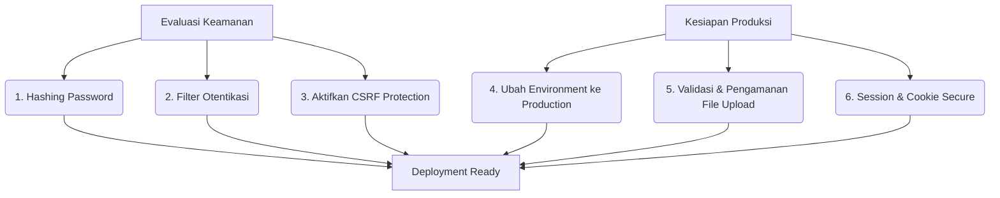

# 🚀 Roadmap Menuju Produksi (Ready for Production) — MBUG

Dokumen ini disusun untuk membantu pengembang (developer) menyempurnakan aplikasi **MBUG** agar siap digunakan di lingkungan produksi (*live/production server*) secara aman dan optimal. Panduan ini mencakup peningkatan fungsional, keamanan, serta cara menerapkannya dalam framework **CodeIgniter 4 (CI4)**.

---

## 🗺️ Peta Jalan (Roadmap) Utama



---

## 🔒 1. Keamanan Aplikasi (Security)

### A. Hashing Password (Wajib)
**Masalah Sekarang:** Aplikasi saat ini menyimpan password pengguna dalam bentuk teks polos (*plain text*) di tabel `user`, dan memeriksanya secara langsung di query database:
`->where(array('username' => $username, 'password' => $password))`

**Solusi & Cara Meningkatkannya:**
Gunakan fungsi bawaan PHP yang aman yaitu `password_hash()` saat menyimpan/mengubah password, dan `password_verify()` saat proses login.

*   **Saat Mendaftarkan / Mengubah Password:**
    ```php
    // Ganti penyimpanan password lama dengan hash:
    $hashedPassword = password_hash($passwordBaru, PASSWORD_BCRYPT);
    ```
*   **Saat Verifikasi Login (`app/Controllers/User.php` atau `Admin.php`):**
    Ubah logika pencarian database hanya berdasarkan `username`, lalu verifikasi password-nya di memori PHP:
    ```php
    // Ambil data user berdasarkan username saja
    $user = $this->userModel->where('username', $username)->first();

    if ($user && password_verify($passwordInput, $user['password'])) {
        // Login Sukses! Set session di sini...
    } else {
        // Login Gagal!
    }
    ```

---

### B. Filter Otentikasi (Auth Filter / Middleware)
**Masalah Sekarang:** Setiap fungsi di controller memeriksa hak akses secara manual:
`if (session()->get('hak_akses') != "0") { ... }`
Jika Anda lupa menambahkan baris ini di fungsi baru, halaman tersebut akan langsung bocor ke publik.

**Solusi & Cara Meningkatkannya:**
Gunakan **Filters** bawaan CodeIgniter 4 yang bertindak sebagai *middleware* global untuk memproteksi seluruh grup rute secara otomatis.

1.  **Buat Filter Baru** (misal: `app/Filters/UserAuth.php`):
    ```php
    <?php
    namespace App\Filters;

    use CodeIgniter\Filters\FilterInterface;
    use CodeIgniter\HTTP\RequestInterface;
    use CodeIgniter\HTTP\ResponseInterface;

    class UserAuth implements FilterInterface
    {
        public function before(RequestInterface $request, $arguments = null)
        {
            if (session()->get('hak_akses') !== "0") {
                session()->setFlashdata('belum_login', 'Anda Belum Login Sebagai User');
                return redirect()->to(base_url('/user/login'));
            }
        }

        public function after(RequestInterface $request, ResponseInterface $response, $arguments = null) {}
    }
    ```
2.  **Daftarkan Filter** di `app/Config/Filters.php`:
    ```php
    public array $aliases = [
        // Tambahkan alias filter Anda di sini:
        'userAuth'  => \App\Filters\UserAuth::class,
        'adminAuth' => \App\Filters\AdminAuth::class,
        ...
    ];
    ```
3.  **Terapkan pada Rute** di `app/Config/Routes.php`:
    ```php
    // Proteksi seluruh group secara otomatis!
    $routes->group('user', ['filter' => 'userAuth'], function ($routes) {
        // Semua rute di dalam grup ini otomatis aman tanpa cek session manual lagi!
        $routes->get('home', 'User::user_home');
        $routes->get('profile', 'User::user_profile');
    });
    ```

---

### C. Aktifkan CSRF (Cross-Site Request Forgery) Protection
**Masalah Sekarang:** Filter CSRF dinonaktifkan di `app/Config/Filters.php`. Ini membuat aplikasi rentan terhadap serangan manipulasi form dari luar situs.

**Solusi & Cara Meningkatkannya:**
1.  Buka `app/Config/Filters.php` dan aktifkan `'csrf'` pada bagian `globals` -> `before`:
    ```php
    public array $globals = [
        'before' => [
            'csrf', // Aktifkan ini
        ],
    ];
    ```
2.  Di setiap form HTML (`.php` di Views), pastikan Anda menyisipkan token CSRF:
    ```html
    <!-- Menggunakan Helper CI4 Form -->
    <?= csrf_field() ?>
    
    <!-- Atau HTML manual -->
    <input type="hidden" name="<?= csrf_token() ?>" value="<?= csrf_hash() ?>" />
    ```

---

### D. Parameter Binding pada Query Builder
Pastikan Anda selalu menggunakan CI4 Query Builder (seperti `$this->db->table()->where()`) untuk query database. Hindari menulis query SQL mentah menggunakan konkatenasi string (contoh: `$this->db->query("SELECT * FROM user WHERE id = " . $id)`) karena sangat rentan terhadap **SQL Injection**. Query Builder bawaan CI4 secara otomatis melakukan parameter binding yang aman.

---

## 📈 2. Pengoptimalan Produksi (Production Optimization)

### A. Ubah Environment ke `production`
Pada server produksi, ubah nilai `CI_ENVIRONMENT` di file `.env` menjadi `production`:
```env
CI_ENVIRONMENT = production
```
**Mengapa ini penting?**
*   **Keamanan**: Mematikan Debug Toolbar CI4 yang menampilkan informasi sensitif (struktur DB, konfigurasi file, file sistem).
*   **Tampilan User**: Menyembunyikan detail pesan error mentah (seperti stack trace PHP) yang membingungkan pengguna dan berbahaya jika dibaca hacker. Pesan error akan dialihkan ke halaman default 500 yang ramah.
*   **Performa**: Meningkatkan kecepatan eksekusi framework karena debugger dinonaktifkan.

---

### B. Validasi File Upload yang Ketat
Pada form pengunggahan berkas (seperti KRS, Bukti Pembayaran, Rangkuman Nilai), pastikan validasi tipe file (*MIME type*) dan ukurannya diimplementasikan dengan sangat ketat agar tidak ada file berbahaya (seperti skrip `.php`) yang bisa diunggah ke server.

Contoh validasi unggahan yang aman:
```php
if ($this->validate([
    'krs' => [
        'rules' => 'uploaded[krs]|max_size[krs,2048]|ext_in[krs,pdf]|mime_in[krs,application/pdf]',
        'label' => 'File KRS'
    ]
])) {
    // Proses upload
}
```

---

### C. Konfigurasi Cookie & Session Secure
Untuk menjamin keamanan session pengguna di server produksi yang menggunakan HTTPS, ubah pengaturan cookie pada `app/Config/Cookie.php` atau `.env`:
```env
cookie.secure = true
cookie.httponly = true
cookie.samesite = 'Lax'
```
*   `secure = true`: Memastikan cookie session hanya dikirimkan melalui koneksi HTTPS yang terenkripsi.
*   `httponly = true`: Mencegah script jahat (XSS) membaca token session melalui JavaScript (`document.cookie`).

---

## 🛠️ 3. Tips untuk Kembali ke PHP & CodeIgniter 4

Jika Anda baru kembali lagi ke dunia PHP dan CodeIgniter setelah sekian lama:

1.  **Gunakan Composer Secara Penuh**: Jangan mengunggah folder `vendor/` ke Git (kecuali jika struktur proyek Anda mengharuskannya). Gunakan `composer install` pada server deployment untuk menginstal seluruh dependency yang didefinisikan di `composer.json`.
2.  **Gunakan namespace & PSR-4**: CI4 menggunakan standar autoloading modern. Pastikan nama kelas dan nama file Anda sesuai (sensitif terhadap huruf besar/kecil) agar tidak terjadi error "Class not found" saat dideploy ke server Linux (Docker development di Windows seringkali mengabaikan perbedaan huruf besar/kecil ini, tetapi server produksi Linux sangat ketat).
3.  **Gunakan helper `esc()`**: Selalu gunakan fungsi `esc($variable)` saat menampilkan data dari database ke dalam HTML/Views untuk mencegah celah keamanan **XSS (Cross-Site Scripting)**.
    ```php
    <!-- Contoh Aman -->
    <td><?= esc($penerima->nama) ?></td>
    ```
